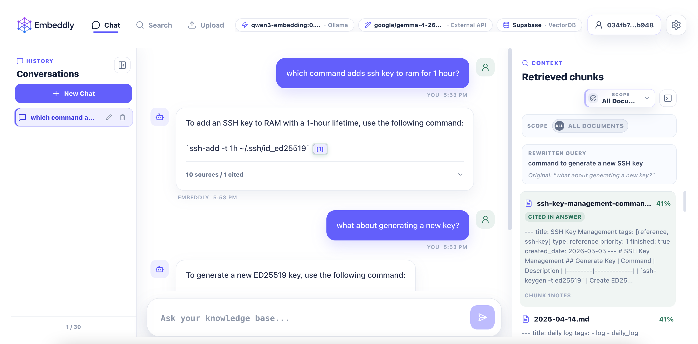

# Embeddly

Embeddly is a ~~local-first~~ RAG knowledge search app for private documents. It helps you upload files, turn them into searchable embeddings, explore semantic results, and chat with retrieved context while keeping the default data path on your machine.

The app is built around a search-first interface with document upload, project-scoped retrieval, a background embedding queue, source-aware chat, and configurable model/storage settings.



## Features

- Upload documents and manage them in a local knowledge base.
- Parse and chunk PDF, CSV, Markdown, and text files.
- Generate embeddings through Ollama or any other LLMs prefer through external APIs.
- Search semantically across all documents or a selected project.
- Explore search results through a connected mind-map style result view.
- Chat with retrieved context and source citations.
- Track embedding progress, completed jobs, and failed jobs.
- Configure chunking, embedding, generation, reranking, and vector storage from Settings.
- Use SQLite locally by default, or connect Supabase pgvector as an optional vector database.
- Optionally sign in with LNURL-Auth so wallet users can keep settings and credentials isolated.
- Store API keys and Supabase service role keys encrypted at rest and masked in responses.

## Requirements

- Node.js and npm.
- ~~Ollama for local embeddings and local chat models.~~
- At least one Ollama embedding model, such as `nomic-embed-text`.
- At least one Ollama chat model if you want fully local chat, such as `llama3.2`.
- Supabase is optional and only needed if you switch VectorDB from SQLite to Supabase.

Example Ollama model setup:

```sh
ollama pull nomic-embed-text
ollama pull llama3.2
```

## Local Setup

Install dependencies:

```sh
npm install
```

Start the backend API:

```sh
npm run server
```

Start the frontend in a second terminal:

```sh
npm run dev
```

By default:

- Express runs on `http://localhost:3001`.
- The frontend API client calls `http://localhost:3001/api`.
- Vite serves the React app on its normal local development URL.

The user runs the local dev server for this project. Agents should not run `npm install` or `npm run dev` unless the project instructions change.

## First Run

1. Open the Vite app in your browser.
2. Go to Settings.
3. Configure an embedding model served by Ollama.
4. Configure a generation model, either local Ollama or an OpenAI-compatible external API.
5. Keep VectorDB set to SQLite for the simplest local setup, or configure Supabase if you need remote pgvector storage.
6. Upload files from the Upload view.
7. Move files into the knowledge base pane.
8. Start embedding and wait for the queue to complete.
9. Use Search or Chat once documents have completed embedding.

If Search or Chat is unavailable, check the model status bar and Settings page for missing embedding, generation, or VectorDB configuration.

## Main Workflows

### Upload and Embed

Files are uploaded to `server/uploads/`, recorded in SQLite, parsed into chunks, embedded through Ollama, and indexed into the active vector store. Embedding runs through a background queue, and progress is visible from the upload workflow and topbar status indicator.

### Search

Search embeds your query, retrieves similar chunks from the active vector store, optionally reranks candidates, and returns ranked results. You can search all documents or limit retrieval to one project.

### Chat

Chat retrieves relevant chunks for each prompt, builds a source-aware context, and streams the answer from the configured generation provider. Conversations are stored in the browser through IndexedDB, while the server keeps only a short in-memory hot cache for recent chat context.

### Projects

Projects group documents so search and chat can be scoped to a named dataset. You can create and manage projects in Settings, assign uploaded documents to projects, and switch retrieval scope from the chat, search, and upload surfaces.

### Settings

Settings are persisted server-side in SQLite. Anonymous users use global settings. LNURL-Auth users get user-scoped settings in the credential database, with global settings as fallback. API keys and Supabase service role keys are encrypted before storage and masked when returned to the frontend.

## Configuration

Most user-facing configuration is managed in the Settings page. Environment variables are optional for normal local development.

| Variable                       | Default                  | Purpose                                                          |
| ------------------------------ | ------------------------ | ---------------------------------------------------------------- |
| `PORT`                         | `3001`                   | Express server port.                                             |
| `OLLAMA_BASE_URL`              | `http://localhost:11434` | Ollama API base URL for server-side embedding and chat calls.    |
| `OLLAMA_KEEP_ALIVE`            | `30m`                    | Ollama model keep-alive setting.                                 |
| `OLLAMA_NUM_CTX`               | `4096`                   | Context window option sent to Ollama chat.                       |
| `OLLAMA_NUM_PREDICT`           | `384`                    | Max generated token option sent to Ollama chat.                  |
| `OLLAMA_TEMPERATURE`           | `0.2`                    | Generation temperature.                                          |
| `OLLAMA_REWRITE_TIMEOUT_MS`    | `3000`                   | Timeout for follow-up query rewriting.                           |
| `EXTERNAL_API_CHAT_TIMEOUT_MS` | `60000`                  | Timeout for OpenAI-compatible external chat APIs.                |
| `EMBEDDLY_ENCRYPTION_KEY`      | File-backed key          | Optional server-side key material for settings encryption.       |
| `TRANSFORMERS_CACHE`           | `server/.models`         | Optional cache directory for local reranker model downloads.     |
| `PREWARM_RERANKER`             | unset                    | Set to `true` to load the reranker model when the server starts. |

## Vector Storage

SQLite is the default vector store. It stores vectors in the local `embeddings` table and ranks results with in-process cosine similarity.

Supabase pgvector is optional. Before switching to Supabase in Settings, apply the schema in `references/supabase-vector-schema.sql` from the Supabase SQL editor. The schema uses a default vector dimension; adjust the table and RPC function if your embedding model uses a different dimension.

## Data and Privacy

Embeddly is designed for private local knowledge workflows, but privacy depends on the providers you configure.

| Path                   | Purpose                                                                                |
| ---------------------- | -------------------------------------------------------------------------------------- |
| `server/embedly.db`    | Main SQLite database for documents, chunks, jobs, settings, and local vectors.         |
| `server/cred.sqlite`   | Optional credential database for LNURL-Auth users, sessions, and user-scoped settings. |
| `server/uploads/`      | Uploaded file storage.                                                                 |
| `server/.embeddly/key` | File-backed encryption key material when `EMBEDDLY_ENCRYPTION_KEY` is not set.         |
| `server/.models/`      | Default local reranker model cache.                                                    |
| `dist/`                | Vite build output.                                                                     |

Private document contents should not be logged or exposed unnecessarily. If you use an external OpenAI-compatible API for chat, prompts and retrieved document context leave your local machine. Local Ollama keeps embedding and generation requests on your configured Ollama host.

## Scripts

| Command                 | Purpose                                       |
| ----------------------- | --------------------------------------------- |
| `npm run server`        | Start the Express API server.                 |
| `npm run dev`           | Start the Vite frontend dev server.           |
| `npm run build`         | Build the frontend for production.            |
| `npm test`              | Run all Node test files.                      |
| `npm run test:server`   | Run server tests.                             |
| `npm run test:services` | Run service tests.                            |
| `npm run test:coverage` | Run tests with Node coverage.                 |
| `npm run test:watch`    | Run tests in watch mode.                      |
| `npm run test:filename` | Run the focused filename normalization tests. |

## Project Structure

```text
embedly/
  src/                         # React frontend application
    components/                # UI components and co-located CSS
    lib/                       # API, auth, storage, and browser persistence helpers
    App.jsx                    # Root component and hash routing
    main.jsx                   # React entry point
  server/                      # Express backend application
    routes/                    # API route handlers
    services/                  # Parsing, chunking, embedding, retrieval, LLM, settings
    db.js                      # SQLite schema and shared database helpers
    index.js                   # Server entry point
  references/                  # Reference images, proposals, and Supabase schema
  CODEBASE.md                  # Architecture and implementation map
  DESIGN.md                    # Visual system and UI behavior guide
  Embedding-Plan.md            # Embedding implementation notes
```

## Troubleshooting

### Ollama is not reachable

Make sure Ollama is running and that Settings points to the same endpoint as `OLLAMA_BASE_URL`, usually `http://localhost:11434`.

### No embedding models appear

Pull an embedding-capable model locally, then refresh the Settings model list:

```sh
ollama pull nomic-embed-text
```

### Search returns no results

Confirm that files are not only uploaded but also embedded. Uploaded files must be moved into the knowledge base and processed by the embedding queue before semantic search can find them.

### Chat cannot answer from documents

Check that embedding, generation, and VectorDB settings are configured. Also confirm that the selected project scope contains embedded documents.

### External API chat fails

Verify the endpoint, model name, and API key. Use a base URL such as `https://api.openai.com/v1` or another OpenAI-compatible `/v1/chat/completions` endpoint.

### Supabase VectorDB validation fails

Apply `references/supabase-vector-schema.sql`, confirm the table name and dimensions, and check that the service role key is valid. The service role key is sensitive and should only be stored through Settings.

### Reranking is slow the first time

The first enabled reranker query may download a Transformers.js model. Set `TRANSFORMERS_CACHE` if you want the cache in a specific location, or set `PREWARM_RERANKER=true` to load the reranker when the server starts.

## Further Documentation

- [CODEBASE.md](CODEBASE.md) explains the current architecture, API endpoints, data flows, and service boundaries.
- [DESIGN.md](DESIGN.md) defines the visual system, layout behavior, and interface-specific design rules.
